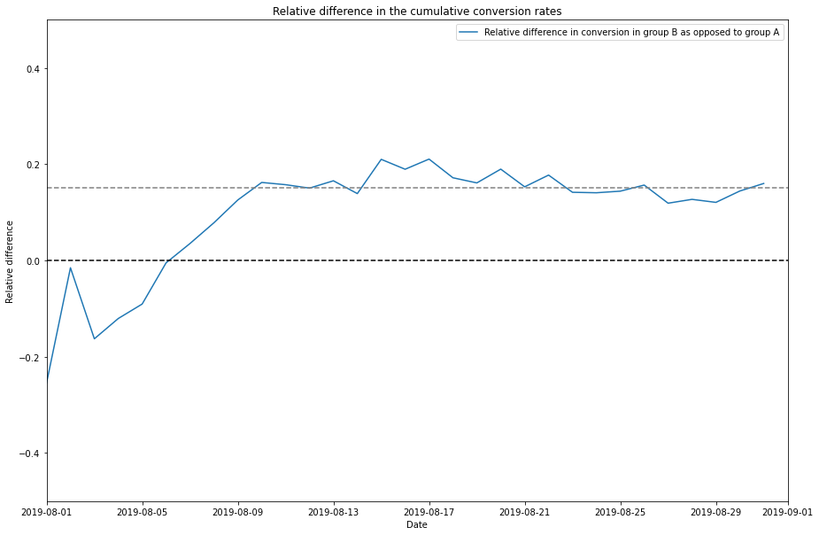
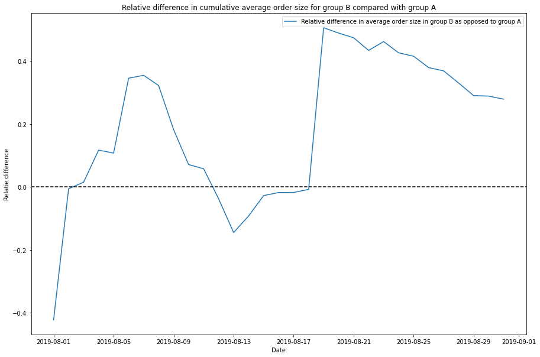
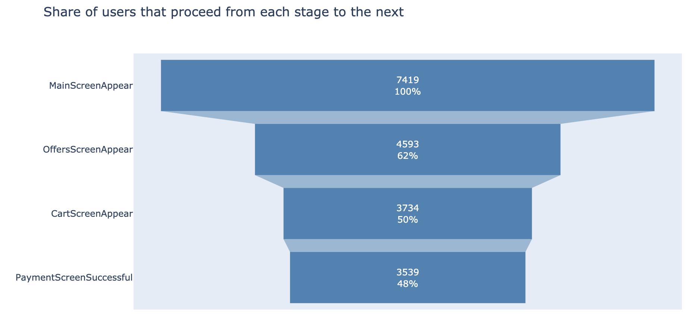
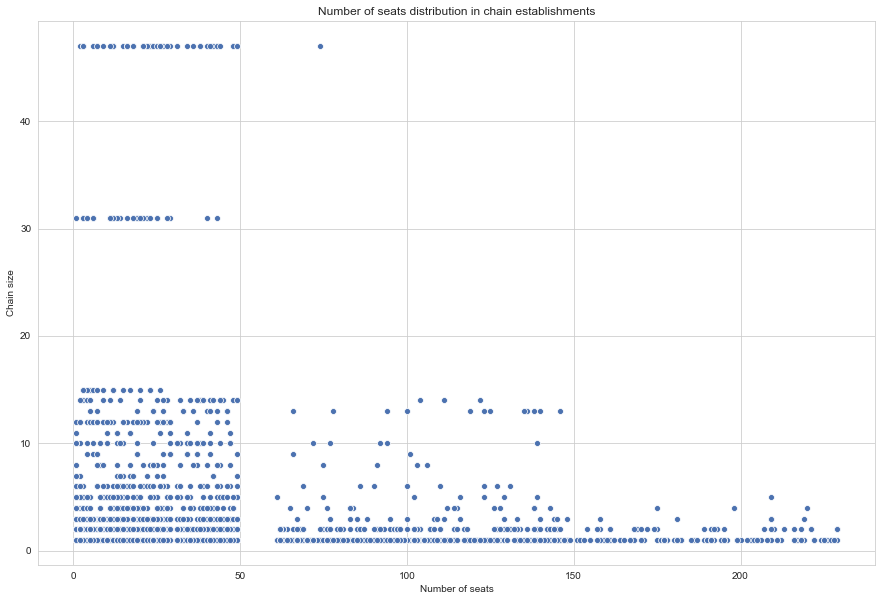
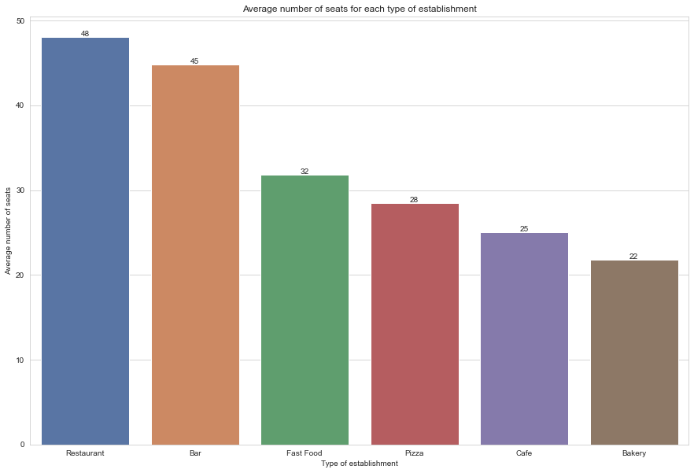

# Projects Overview
## [Online store A/B testing](https://github.com/artefazosya/Elizaveta_Gorbunova_Portfolio/blob/main/07_Online_store_AB_testing/07_Online_store_AB_testing.ipynb)
 
 In this project I've worked with data on orders and visits of an online store:
 * I prioritised list of hypotheses to test using ICE and RICE scores
 * Analysed results of A/B test: compared cumulative revenue, order size, conversion rate for each group
 * Detected anomalies in data
 * Checked whether there was statistical significance between groups using data with and without anomalies
 * Provided recommendations 
 
**Key words**: hypotheses prioritization, hypotheses testing, A/B testing

**Libraries used**: pandas, matplotlib, scipy, seaborn

## [Mobile app conversion](https://nbviewer.jupyter.org/github/artefazosya/yandex-practicum/blob/bf518d04cd31bf8bb81d7a34cd361fb2e9eb54bf/09_Mobile_app_conversion/09_Mobile_app_conversion.ipynb)
 
 In this project I've analysed logs of a mobile app to improve conversion and analyze experiment results:
 * I've checked how many logs are there per each date, chose a suitable date interval for analysis
 * Counted user actions and created a sales funnel
 * Gave recommendations on conversion improvement
 * Checked whether there were any statistically significant differences between each group
 * Interpreted the results of the A/A/B experiment
 
**Key words**: sales funnel, conversion, A/B test, user behaviour. 

**Libraries used**: pandas, plotly, seaborn, scipy.

## [Food market research](https://github.com/artefazosya/yandex-practicum/blob/main/08_Food_market_research/08_Food_market_research.ipynb)
 
 In this project I've worked with data on food market in LA to provide recommendations for a new restaurant investors:
 * I counted different types of establishments
 * Found dependencies between type of establishment and belonging to a chain
 * Visualised number of seats distribution
 * Investigated LA streets with a lot of restaurants
 * Formulated recommendations 
 
**Key words**: pie chart, bar plot, scatter plot, distribution plot. 

**Libraries used**: pandas, matplotlib, numpy, plotly, seaborn.

# Course Overview
This repository is dedicated to the projects completed during the **"Yandex.Practicum Data Analysis"** professional program. 

It covered the following themes:
1. Data Preprocessing (Python)
2. Exploratory Data Analysis (pandas, numpy)
3. Statistical Data Analysis (statistics, hypotheses testing)
4. Data Collection and Storage (HTML, SQL)
5. Business Analytics (LTV, CAC, ROMI)
6. Making Business Decisions Based on Data (hypotheses prioritization, A/B testing)
7. Automation (Tableau)
8. Forecasts and Predictions (Machine Learning)

 

